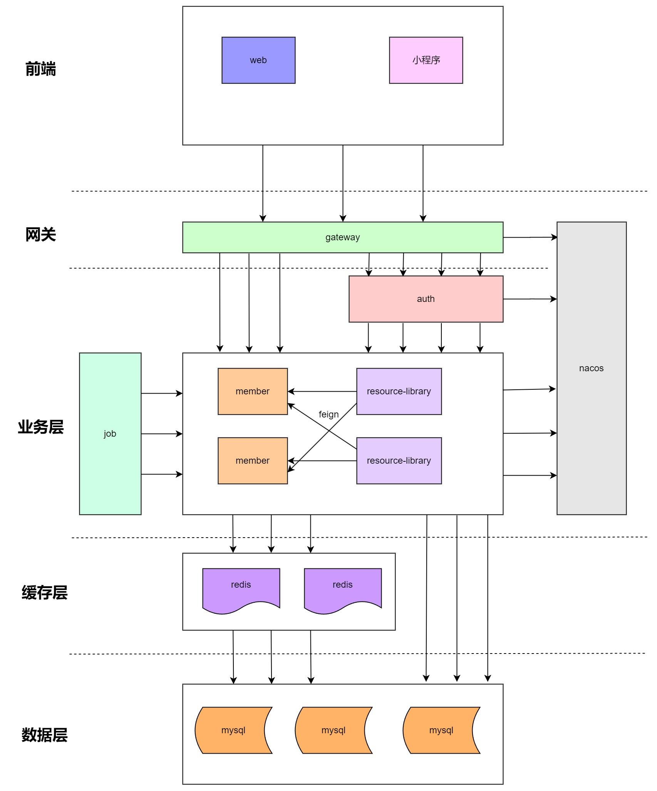

# 时光印记
1. 功能菜单：首页、档案馆、照片墙、视频馆、标签库、日志本

## 服务列表

- si-framework 
  基础框架 
- si-utils 
  工具类
- si-gateway
  网关服务,请求统一入口
- si-auth
  认证中心，统一权限认证
- si-member
  会员中心，用户管理和角色管理 
- si-resource-library 
  资源库，图片、视频、文本管理
- si-mq 
  消息中心,接收异步消息通知
- si-job 
  任务调度服务

- todo:actuator

## 后端技术栈
- Spring Cloud  Greenwich.SR6
- Spring Cloud Gateway
- Spring Cloud Alibaba  2.1.0.RELEASE

## 系统架构设计图

